# MediCare — Hospital Appointment & Patient Management System

Full-stack MERN app for booking hospital appointments. Patients can browse
doctors, check availability, and book a slot; admin staff manage the doctor
list, patient accounts, and approve/reject/complete appointments.

Major Componants: React, Node/Express, MongoDB, JWT auth, protected routes,
CRUD, search/filter, and duplicate-booking prevention.

## Stack

- **Frontend:** React, React Router, Axios, plain CSS3
- **Backend:** Node.js, Express, REST API
- **Database:** MongoDB via Mongoose
- **Auth:** JWT + bcrypt password hashing

## A note on the collections

The assignment brief lists four MongoDB collections: `users`, `doctors`,
`patients`, `appointments`. In practice a patient login *is* a user account,
so this build keeps one `users` collection with a `role` field
(`patient` / `admin`) instead of maintaining two collections that would just
duplicate each other's fields. Doctors are a separate collection since they
aren't login accounts — only admins manage them.

## Features

- Patient registration (name, email, password, phone, DOB, gender, address) and login
- Shared login endpoint for both patients and admin, JWT-based, role-aware routing on the frontend
- Doctor catalogue: search, specialization filter, day-of-week availability filter, sorting, pagination
- Doctor profile page with full details and a Book Appointment flow
- Appointment booking: checks the doctor is actually available that weekday and blocks double-booking the same doctor/date/time slot (enforced both in code and with a MongoDB partial unique index as a safety net)
- Patient dashboard: upcoming / completed / cancelled counts, quick doctor list
- My Appointments page with cancellation (only pending/confirmed appointments can be cancelled)
- Admin dashboard: add/edit/delete doctors, activate/deactivate doctors, manage patients (block/activate), view every appointment and change its status (pending → confirmed → completed, or reject/cancel)
- Backend validation on every write route, centralized error handling, no hard-coded records — everything comes from the database through the app itself

## Prerequisites

- Node.js v18+
- MongoDB running locall

## Running it

### 1. MongoDB
Make sure `mongod` is running (see the earlier setup notes if you're still getting it installed).

### 2. Backend
```bash
cd hospital-appointment-system/backend
npm install
npm run seed      # creates admin@hospital.com / Admin@123
npm run dev
```
Runs on `http://localhost:5000`. Health check: `/api/health`.

### 3. Frontend
```bash
cd hospital-appointment-system/frontend
npm install
npm start
```
Runs on `http://localhost:3000`.

## Using it

1. Log in as admin (`admin@hospital.com` / `Admin@123`) and add a few doctors from the Admin Dashboard — this has to happen first, since patients can only book against doctors that already exist.
2. Register a patient account, browse **Find a Doctor**, open a profile, and book a slot.
3. Back in the Admin Dashboard → Appointments tab, change that booking's status from `pending` to `confirmed` (or `rejected`).
4. As the patient, check **My Appointments** — the status updates, and you can cancel while it's still pending/confirmed.

## Project structure

```
backend/
  config/db.js
  models/            User, Doctor, Appointment
  middleware/         auth.js (JWT + role check), errorHandler.js
  controllers/         authController, doctorController, appointmentController, patientController
  routes/
  utils/generateToken.js
  seed/seed.js         creates the admin login only
  server.js

frontend/
  src/
    api/axios.js       axios instance with JWT interceptor
    context/AuthContext.js
    components/         Navbar, DoctorCard, DoctorFilterBar, ProtectedRoute, Loader, Alert
    pages/               DoctorCatalogue, DoctorDetails, BookAppointment,
                          Login, Register, PatientDashboard, MyAppointments,
                          AdminDashboard, AdminDoctorForm, NotFound
    styles/index.css
```

## REST API

```
POST   /api/auth/register
POST   /api/auth/login
GET    /api/auth/me

GET    /api/doctors                (search, specialization, day, sortBy, order, page, limit)
GET    /api/doctors/:id
POST   /api/doctors                admin
PUT    /api/doctors/:id            admin
DELETE /api/doctors/:id            admin

POST   /api/appointments           patient books
GET    /api/appointments           role-scoped (own vs all)
GET    /api/appointments/:id
PUT    /api/appointments/:id       reschedule while still pending
PUT    /api/appointments/:id/status  admin only - confirm/reject/complete/cancel
DELETE /api/appointments/:id       cancel (patient or admin)

GET    /api/patients               admin
PUT    /api/patients/:id/status    admin - block/activate
```

## Booking rules, in plain terms

- A patient can't book a slot that clashes with another active (pending/confirmed/completed) appointment for the same doctor, date, and time.
- A patient can't book on a day the doctor doesn't work.
- A patient can't book in the past.
- Once a doctor's or patient's appointment is completed, cancelled, or rejected, it can't be cancelled again or edited.

## Screenshots

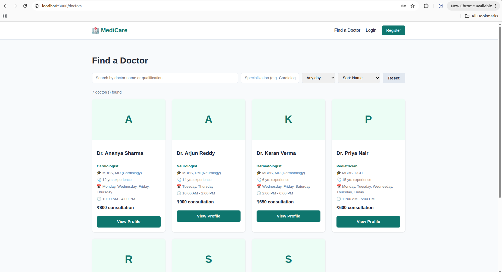

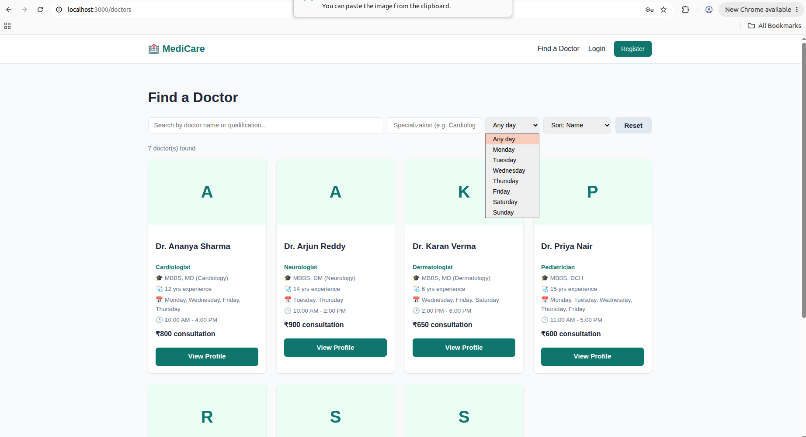

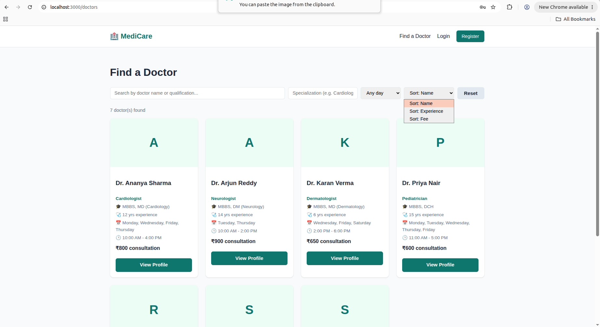

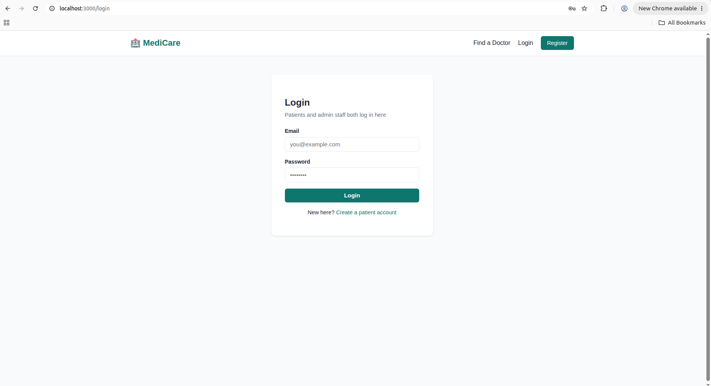

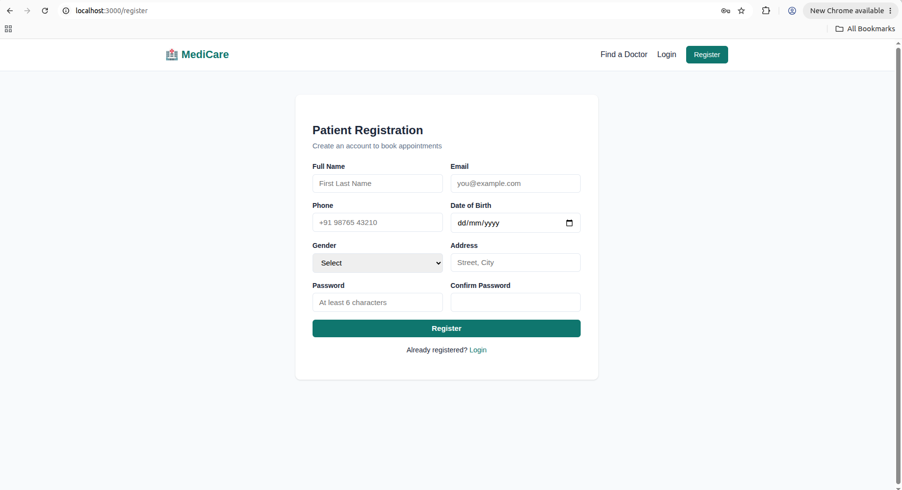

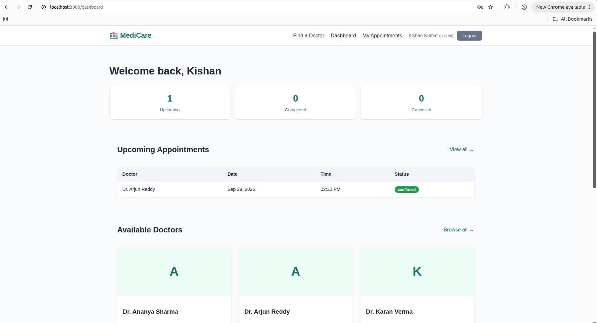

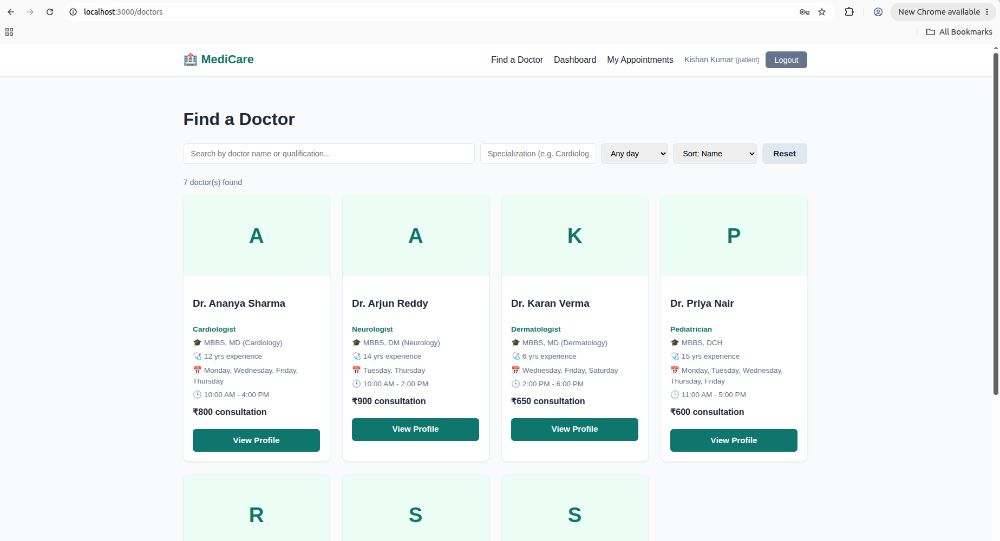

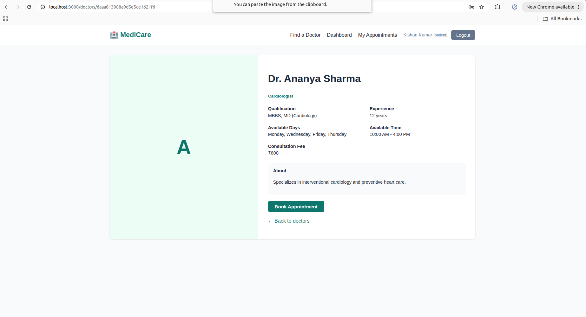

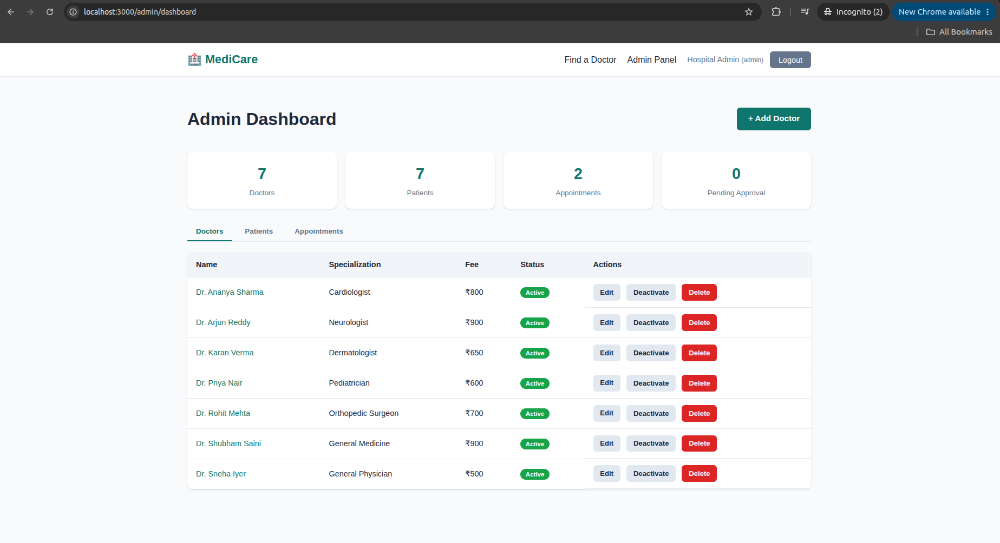

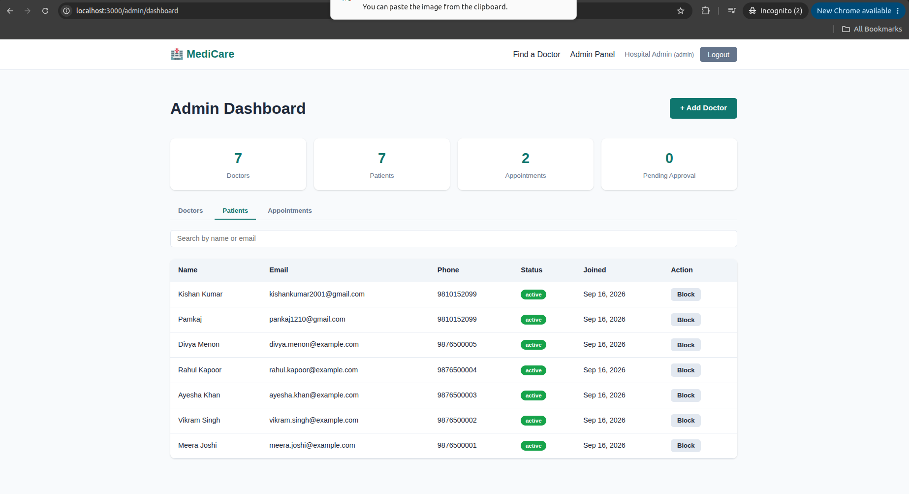

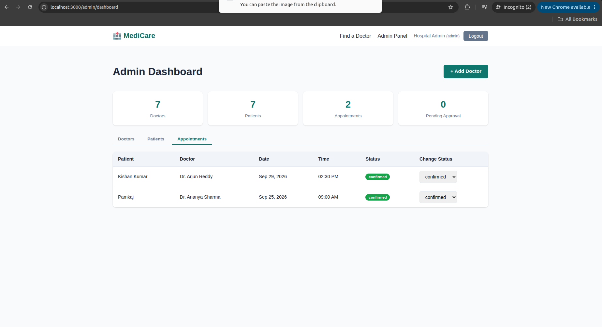

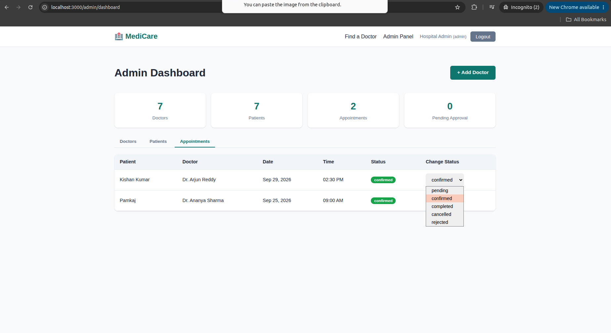

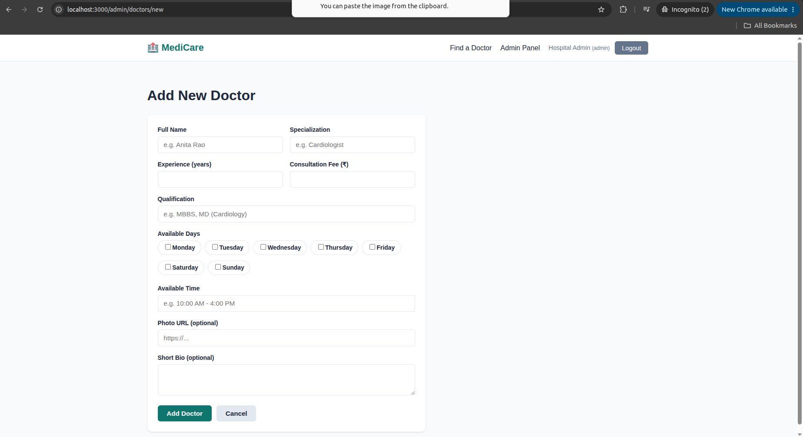

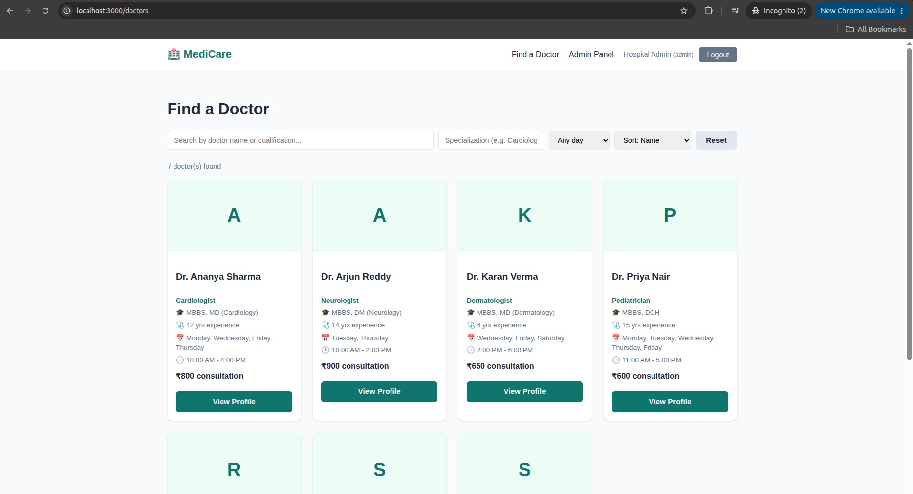

---

Developed by Pankaj Saini
